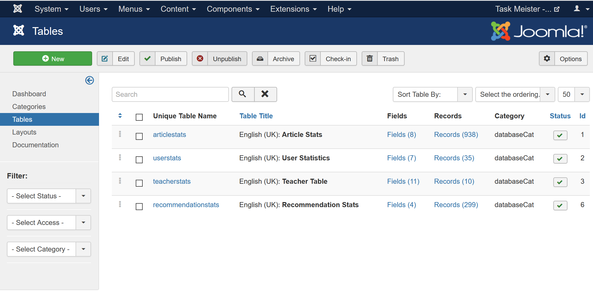
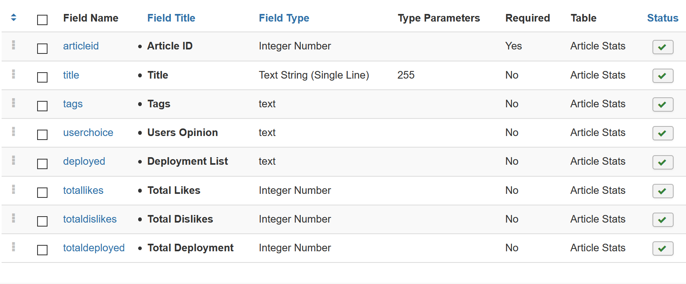
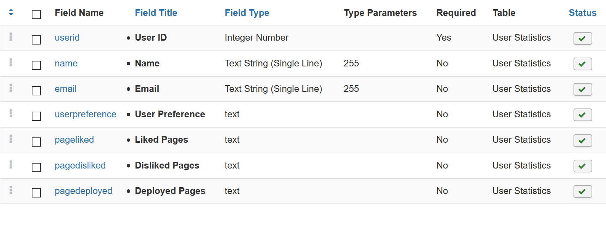
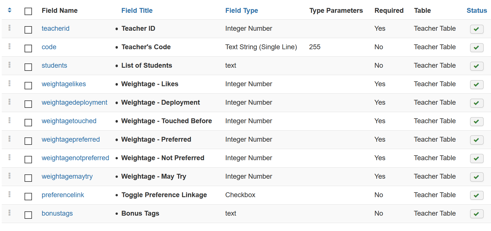

# Task-Meister
Work involving Joomla-cms. It comes with a template (has 4 themes) and a custom-made recommender engine.

Check our website at: https://iwant2study.org/taskmeisterx/index.php/

## Types of files inside the Repository
Components 
- Components are the largest and most complex extensions of them all; they can be seen as mini-applications. Our Review Component is located here.

Modules
- Modules are more lightweight and flexible extensions used for page rendering. Most of the other display units such as the thumbs up buttons or the articles recommendations are located here.

Plugins
- Plugins are more advanced extensions and are in essence event handlers. This is where our Recommendation Engine runs its functions.

Templates
- A template is basically the design of the Joomla! powered website. Essentially the Look and Feel. Currently we are using our custom made Taskmeister template that comes with 4 themes. 

## Important Links for users/editors
SCSS file to edit the CSS of the taskmeister template:
https://github.com/FremontTeng/Task-Meister/blob/master/templates/taskmeister/css/template.scss

Chai Seng's CSS:
https://github.com/FremontTeng/Task-Meister/blob/master/templates/taskmeister/css/old.css

## Installing a template/module/plugin
### Install Templates via FTP
1. Simply upload the template folder here to the directory: /path_to_joomla/templates/ - where /path_to_joomla/ is the location of your Joomla! installation on the server. (Using any FTP software)
2. Then go into extension manager and click on Discover in the sub menu.
3. Click the checkbox to the left of your template and click on the button 'Install'.

### Install by package
1. Zip the relevant module/plugin/template
2. Drag into the upload package tab

## Additional Installation/Set Up
Custom Tables: (Required for most modules)
- https://joomlaboat.com/custom-tables 
- Version used 1.9.4

### Other ways of installation
See the website: https://docs.joomla.org/J3.x:Installing_a_template

For the Recommender Engine to work, please set up the four custom tables with the following fields as shown in the bottom screenshots. It is recommended to use the exact table and field names (so that you won't need to modify the ones in the modules).

### Screenshots

Shown above are the four custom tables used for the whole recommendation engine.

Shown above are the following fields for the Article Stats Table.
- articleid (Refers to the id of the article)
- title (Refers to the title of the article)
- tags (Refers to the tags of the article)
- userchoice (Refers to the users' opinions of the article)
- deployed (Refers to the list of users that deployed the article)
- totallikes (Refers to the total likes of the article)
- totaldislikes (Refers to the total dislikes of the article)
- totaldeployed (Refers to the total number of users that deployed the article)

Shown above are the following fields for the User Stats Table.
- userid (Refers to the id of the user)
- name (Refers to the name of the user)
- email (Refers to the email of the user)
- userpreference (Refers to the list of tags that the user prefer, against or may try)
- pageliked (Refers to the list of pages that the user likes)
- pagedisliked (Refers to the list of pages that the user dislikes)
- pagedeployed (Refers to the list of pages that the user deployed)

Shown above are the following fields for the Teacher Stats Table.
- teacherid (Refers to the id of the teacher)
- code (Refers to the teacher's unique code/id)
- students (Refers to the list of students that the teacher has)
- weightagelikes (Refers to the teacher's modifier for their class's likes)
- weightagedeployment (Refers to the teacher's modifier for their class's deployed articles)
- weightagetouched (Refers to the teacher's modifier for their class's touched articles)
- weightagepreferred (Refers to the teacher's modifier for their class's preferred tags)
- weightagenotpreferred (Refers to the teacher's modifier for their class's against tags)
- weightagemaytry (Refers to the teacher's modifier for their class's may try tags)
- preferencelink (Unused)
- bonustags (Refers to the teacher's modifier for their class to include additional tag search)

Shown above are the following fields for the Recommendation Stats Table.
- date (Refers to the date of the action)
- aid (Refers to the article id)
- uid (Refers to the user id)
- action (Refers to the user's action on the particular article)

## End Note
To see more information about the individual parts of the repository, please read the readmes in their respective folders.